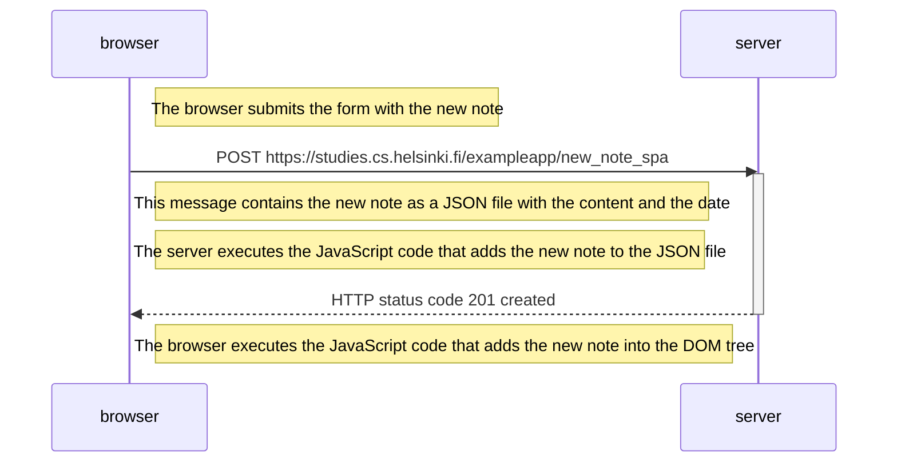

```mermaid

sequenceDiagram
    participant browser
    participant server

    Note right of browser: The browser submits the form with the new note

    browser->>server: POST https://studies.cs.helsinki.fi/exampleapp/new_note_spa
    activate server
    
    Note right of browser: This message contains the new note as a JSON file with the content and the date
    
    Note right of browser: The server executes the JavaScript code that adds the new note to the JSON file
    
    server-->>browser: HTTP status code 201 created
    deactivate server
    
    Note right of browser: The browser executes the JavaScript code that adds the new note into the DOM tree
    
```